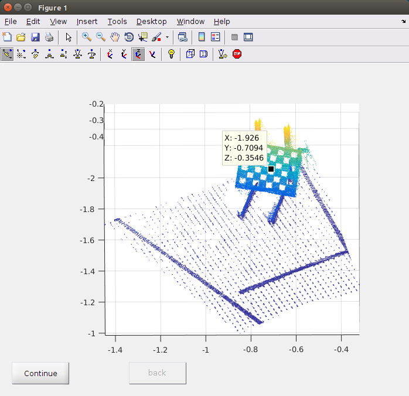

# Laser-Camera-Calibration-Toolbox
This toolbox is a simple extension of the [Laser-Camera Calibration Toolbox] developed by Ranjith Who was at CMU. Thank you for the authors!
The origin toolbox is a little out of date. The main problem is that it illustrates the Laser data by range image, which cannot show really 3D point cloud obtain by laser sensor whose FOV is larger than 180 degrees, e.g. velodyne. So as to improve that, in this extension, I ultize "pcshow" to show the 3D point cloud, replacing the range image. Consequently, the selection of 3D points belonging to the checkboard plane is different to the origin toolbox. Conveniently, the user only needs select one points on the plane, the toolbox will automatically find other points on the checkboard plane.

# How to use the toolbox?
The toolbox is easy to use. As mentioned before, I don't modify a lot, so most steps is identical to origin toolbox, the user can refer to technical report in this repo. The diffrence appears when the user clicks the "select plane" button. Firstly, the user will be prompted to input the index of laser files, this is same to origin toolbox. After that, another sentence will appear, asking the user to choose wich kinds method to select points. Yes, I reserve the origin range image method and add my new method. If the user select range image method, the procedure is identical to origin toolbox. However, if the user chooses the new method, there will be a differnt procedure: A figure window will pop up, just like the following figure. Firstly, the user can rotate and scale the 3D point cloud to clearly focus on the checkboard plane, secondly, enable the "data cursor" on the toolbar, and then click on the point cloud to select one point in the checkboard plane. Please try your best to select the centric point. Afterwards, the user clicks "continue" button, and the selected plane points will be shown in the same figure. If the user satisifies with the plane, clicks "continue" button again to go to next point cloud, otherwise, clicks "back" and goes back to select another point. 

# Methodology
As mentioned in the technical report written by the authors of the toolbox, the technique used in this toolbox was conceived and developed independently of the near identical work by Q. Zhang and R. Pless [1] presented in IROS 2004, which is cited most in the area of laser-camera calibration. I also noticed Vasconcelos et al. proposed a minimal solution [2] for laser-camera calibration, however, intuitively concluding from Vasconcelos's experiment result, his method doesn't perform better when we have enough number of planes in hand (e.g. 15).

[Laser-Camera Calibration Toolbox]: http://www.cs.cmu.edu/~ranjith/lcct.html

## References   

[1] Q. Zhang and R. Pless, “Extrinsic calibration of a camera and laser range finder (improves camera calibration),” in Intelligent Robots and Systems, 2004.(IROS 2004). Proceedings. 2004 IEEE/RSJ International Conference on, 2004, vol. 3, pp. 2301–2306.

[2] F. Vasconcelos, J. P. Barreto, and U. Nunes, “A Minimal Solution for the Extrinsic Calibration of a Camera and a Laser-Rangefinder,” IEEE Transactions on Pattern Analysis and Machine Intelligence, vol. 34, no. 11, pp. 2097–2107, Nov. 2012.

